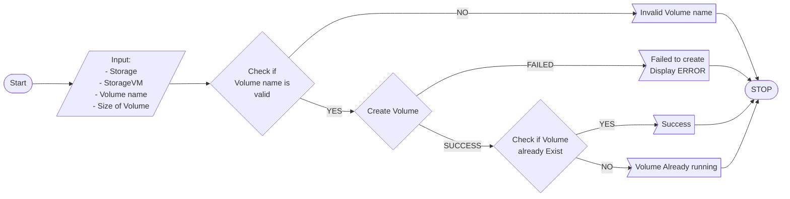

# NetApp_Volume
Python program that connects to NetApp server using RestAPI, lets user create volume into a specific Storage VM  from NetApp server


### Features
- `CREATE` a StorageVM into a given storage
- Helpful CLI

### Requirements
- Python 3.6 or higher
- ONTAP 9 (NetApp storage system) or higher (untested on earlier versions)
- Install docopt

Check [install docopt](https://pypi.org/project/docopt/) for more information


### Usage Example
## Run the program


1. Creating a Volume

```bash
create_vol.py -s [STORAGE] -vm [SVM] -VN [VOLUME] [SIZE]
```  		

4. HELP
```
create_vol.py -h | --help
```

- [STORAGE] => name of your storage
- [SVM] => name of StorageVM
- [VOLUME] => name of Volume you want to create
- [SVM] => Size of the volume that will be created


##FLOWCHART

